# DocBook — Doctor Booking & Appointment App

<p align="center">
  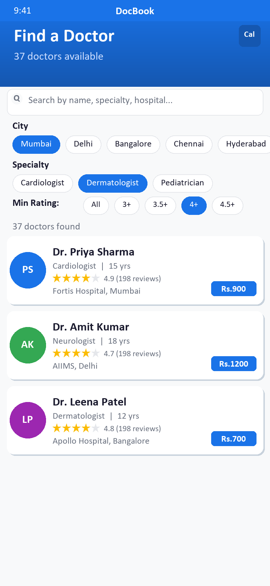
  &nbsp;&nbsp;
  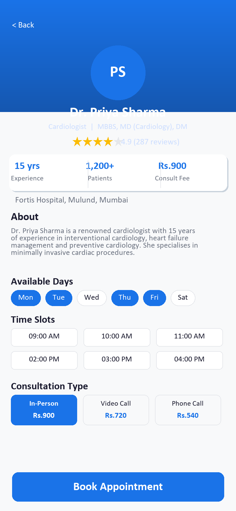
  &nbsp;&nbsp;
  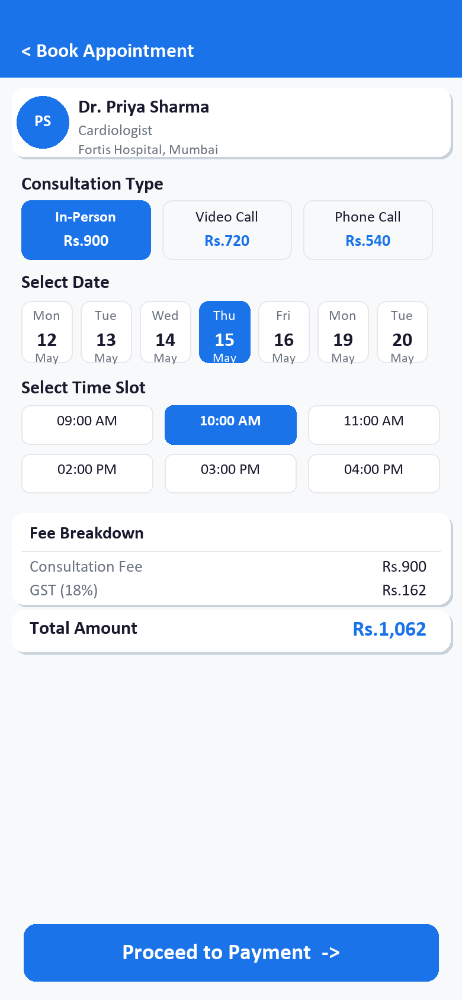
</p>

<p align="center">
  <b>A fully-featured Flutter doctor discovery and appointment booking application</b><br/>
  Find specialists • Book appointments • Pay securely • Manage bookings
</p>

---

## Table of Contents

1. [Overview](#overview)
2. [Tech Stack](#tech-stack)
3. [App Architecture](#app-architecture)
4. [Feature Walkthrough](#feature-walkthrough)
   - [Home Screen — Doctor Discovery](#1-home-screen--doctor-discovery)
   - [Doctor Detail Screen](#2-doctor-detail-screen)
   - [Booking Screen — Appointment Scheduling](#3-booking-screen--appointment-scheduling)
   - [Payment Screen — 4 Payment Methods](#4-payment-screen--4-payment-methods)
   - [Confirmation Screen](#5-confirmation-screen)
   - [My Bookings Screen](#6-my-bookings-screen)
5. [Data & Mock Database](#data--mock-database)
6. [Theme & Design System](#theme--design-system)
7. [Getting Started](#getting-started)
8. [Folder Structure](#folder-structure)
9. [Presentations & Demos](#presentations--demos)

---

## Overview

**DocBook** is a production-ready Flutter mobile application that enables patients to:

- Browse and search **37 doctors** across **8 Indian cities**
- Filter by **specialty, city, and star rating**
- View detailed doctor profiles with **qualifications, bios, and time slots**
- Book appointments with **3 consultation types** (In-Person, Video, Phone)
- Pay via **4 payment methods** — UPI, Card, Wallet, Net Banking
- View and manage all bookings in a **My Bookings** dashboard

---

## Tech Stack

| Layer | Technology |
|---|---|
| Framework | Flutter (Dart ≥ 3.0.0) |
| UI System | Material Design 3 |
| Typography | Google Fonts — Poppins |
| Ratings | flutter_rating_bar 4.0.1 |
| Date Formatting | intl 0.19.0 |
| Unique IDs | uuid 4.3.3 |
| Local Storage | shared_preferences 2.2.2 |
| Icons | cupertino_icons 1.0.6 |

---

## App Architecture

```
lib/
├── main.dart                  # Entry point & route config
├── theme/
│   └── app_theme.dart         # Global color palette & typography
├── models/
│   ├── doctor.dart            # Doctor entity
│   └── booking.dart           # Booking entity + status/type enums
├── data/
│   ├── mock_doctors.dart      # 37-doctor dataset + filter utilities
│   └── booking_store.dart     # In-memory booking repository
├── screens/
│   ├── home_screen.dart       # Doctor discovery & search
│   ├── doctor_detail_screen.dart
│   ├── booking_screen.dart
│   ├── payment_screen.dart
│   ├── confirmation_screen.dart
│   └── my_bookings_screen.dart
└── widgets/
    └── doctor_card.dart       # Reusable doctor list item
```

**Navigation flow:**
```
Home → Doctor Detail → Booking → Payment → Confirmation
                                              ↓
                                        My Bookings
```

---

## Feature Walkthrough

---

### 1. Home Screen — Doctor Discovery

<p align="center">
  
  &nbsp;
  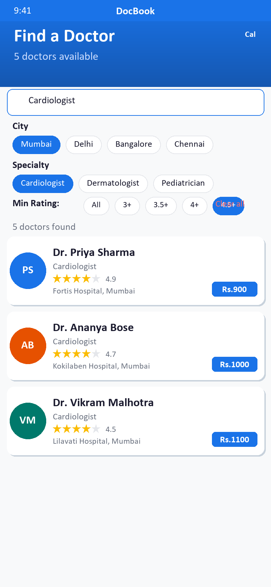
</p>

**What it does:**

The Home Screen is the primary discovery surface, showing all available doctors with powerful real-time filtering.

**Features:**

| Feature | Details |
|---|---|
| App Bar | Gradient blue header showing doctor count; quick link to My Bookings |
| Search Bar | Live search by doctor name, specialty, or hospital name |
| City Filter | Horizontal chip row — Mumbai, Delhi, Bangalore, Chennai, Hyderabad, Pune, Kolkata, Ahmedabad |
| Specialty Filter | Cardiologist, Dermatologist, Pediatrician, Orthopedic, Gynecologist, Neurologist, Psychiatrist, Ophthalmologist |
| Rating Filter | All / 3+ / 3.5+ / 4+ / 4.5+ stars |
| Clear All | One-tap reset of all active filters |
| Results Header | Live count of matching doctors |
| Doctor Cards | Tap to open full doctor profile |
| Empty State | Friendly no-results UI with Clear Filters shortcut |

**Doctor Card contains:**
- Color-coded avatar with doctor initials
- Name, specialty, experience (years)
- Star rating + review count
- Hospital name & city
- Consultation fee (₹)

---

### 2. Doctor Detail Screen

<p align="center">
  
</p>

**What it does:**

Full profile view for a selected doctor with complete information before booking.

**Features:**

| Section | Content |
|---|---|
| Header | Gradient banner with large initials avatar, name, specialty, qualifications |
| Ratings | Star rating + review count badge |
| Stats Row | Years of experience · Patient count · Consultation fee |
| About | Doctor bio and areas of expertise |
| Available Days | Interactive chip list of working days |
| Time Slots | All available time slots for the day |
| Consultation Types | In-Person / Video Call / Phone Call with pricing notes |
| Book Button | Large CTA button navigating to the Booking Screen |

---

### 3. Booking Screen — Appointment Scheduling

<p align="center">
  
</p>

**What it does:**

The Booking Screen allows patients to choose their consultation type, preferred date, and time slot before proceeding to payment.

**Features:**

| Section | Details |
|---|---|
| Doctor Summary | Name, specialty, hospital at the top for reference |
| Consultation Type | In-Person (100% fee) / Video Call (80%) / Phone Call (60%) |
| Date Picker | Horizontal scroll, next 14 available dates based on doctor schedule |
| Time Slots | Grid of available slots for the selected date |
| Fee Breakdown | Consultation fee + 18% GST = Total |
| Proceed Button | Enabled only after date and time are selected |

**Consultation Pricing:**
```
In-Person  → Full fee (₹X)
Video Call → 80% of fee (₹X × 0.8)
Phone Call → 60% of fee (₹X × 0.6)
```

---

### 4. Payment Screen — 4 Payment Methods

<p align="center">
  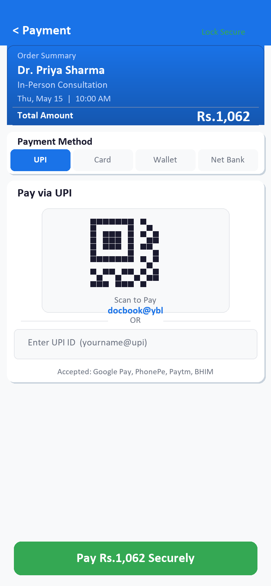
  &nbsp;
  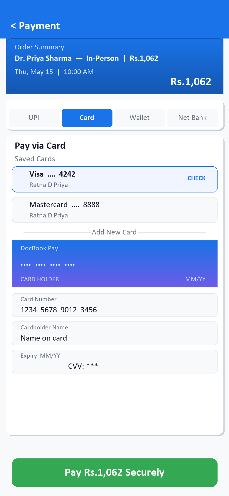
  &nbsp;
  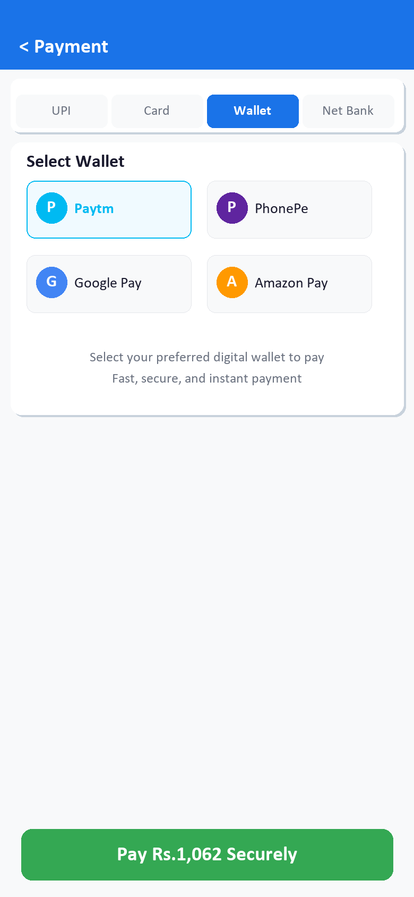
  &nbsp;
  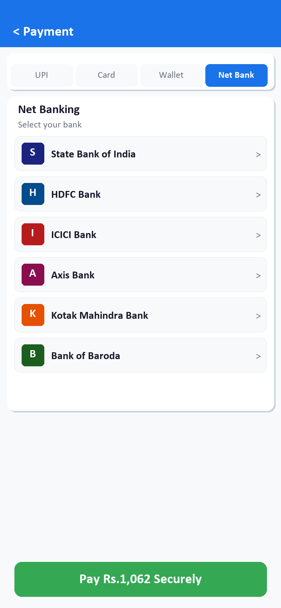
</p>

**What it does:**

A comprehensive payment screen with 4 real-world payment methods, a live order summary, and a simulated secure checkout.

#### Order Summary (top of screen)
- Gradient card showing: Doctor name, consultation type, date & time, **total amount with GST**
- "Secure" indicator with lock icon

#### Payment Method Tabs

**UPI**
- Custom-painted QR code (docbook@ybl)
- Manual UPI ID entry field (yourname@upi)
- Supported apps: Google Pay, PhonePe, Paytm, BHIM

**Card**
- Two pre-saved cards (Visa •••• 4242, Mastercard •••• 8888)
- Live card preview with gradient design
- Add new card form: Card number, Holder name, Expiry (MM/YY), CVV

**Wallet**
- Grid of 4 wallets: Paytm, PhonePe, Google Pay, Amazon Pay
- Color-coded with brand colors

**Net Banking**
- 6 major banks: SBI, HDFC, ICICI, Axis, Kotak, Bank of Baroda
- Colored bank logo tiles with initials

**Pay Button:**
- Shows total with GST (e.g., "Pay ₹1,062 Securely")
- Animated loading state during processing (2-second simulation)
- Navigates to Confirmation on success

---

### 5. Confirmation Screen

<p align="center">
  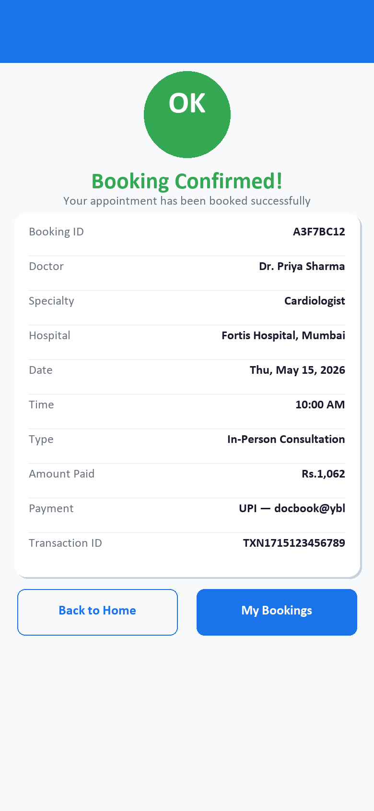
</p>

**What it does:**

Animated success screen confirming the booking with a full summary and navigation options.

**Features:**

| Element | Detail |
|---|---|
| Success Animation | Scale + fade-in transition for the checkmark icon |
| Booking ID | Unique 8-character alphanumeric ID |
| Doctor Details | Name, specialty, hospital |
| Appointment Info | Date, time slot, consultation type |
| Amount Paid | Total including GST |
| Payment Method | Method name + transaction ID |
| Back to Home | Returns to the doctor discovery screen |
| View My Bookings | Navigates to the bookings dashboard |

---

### 6. My Bookings Screen

<p align="center">
  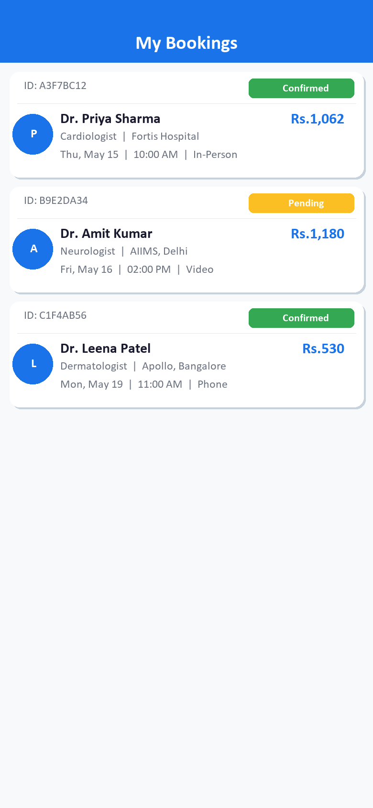
  &nbsp;
  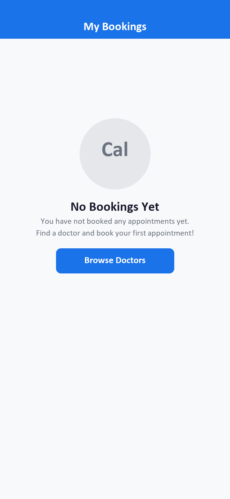
</p>

**What it does:**

A complete appointment management dashboard showing all bookings with their status.

**Features:**

| Feature | Detail |
|---|---|
| Booking Cards | Each card shows full booking info at a glance |
| Booking ID | Unique identifier in header |
| Status Badge | Color-coded: Confirmed (green), Pending (yellow), Cancelled (red), Completed (gray) |
| Doctor Info | Name, specialty, hospital |
| Appointment Details | Date (formatted), time slot, consultation type icon |
| Fee | Amount paid |
| Empty State | Friendly message + "Browse Doctors" shortcut |

---

## Data & Mock Database

**37 doctors** across **8 Indian cities** with realistic data.

| City | Count | Specialties Covered |
|---|---|---|
| Mumbai | 5 | Cardiologist, Dermatologist, Pediatrician, Orthopedic, Gynecologist |
| Delhi | 5 | Neurologist, Dermatologist, Cardiologist, Psychiatrist, Orthopedic |
| Bangalore | 5 | Gynecologist, Cardiologist, Pediatrician, Neurologist, Ophthalmologist |
| Chennai | 5 | Orthopedic, Gynecologist, Cardiologist, Dermatologist, Neurologist |
| Hyderabad | 5 | Cardiologist, Pediatrician, Orthopedic, Dermatologist, Ophthalmologist |
| Pune | 5 | Gynecologist, Cardiologist, Psychiatrist, Neurologist, Pediatrician |
| Kolkata | 4 | Cardiologist, Dermatologist, Neurologist, Orthopedic |
| Ahmedabad | 3 | Cardiologist, Gynecologist, Pediatrician |

**Each doctor has:**
- Rating: 4.4 – 4.9 ⭐
- Experience: 8 – 25 years
- Review counts: 98 – 567 patients
- Fees: ₹500 – ₹1,500
- Real hospital names
- Detailed qualification & bio text
- Available days (Mon–Sat patterns)
- 4–6 time slots per day

---

## Theme & Design System

**Primary Palette:**

| Token | Hex | Usage |
|---|---|---|
| Primary | `#1A73E8` | App bars, buttons, selected states |
| Primary Dark | `#1557B0` | Gradients, pressed states |
| Secondary | `#34A853` | Success states, Pay button |
| Accent | `#FF6B6B` | Alerts, Cancel actions |
| Background | `#F8F9FA` | Screen backgrounds |
| Surface | `#FFFFFF` | Cards, form containers |
| Text Primary | `#1A1A2E` | Headings, body text |
| Text Secondary | `#6B7280` | Subtitles, hints |
| Star | `#FBBC04` | Star ratings |

**Typography:** Google Fonts — Poppins (all weights)
**Design System:** Material Design 3
**Border Radius:** 8–20px (consistent rounded corners)

---

## Getting Started

### Prerequisites
- Flutter SDK ≥ 3.0.0
- Dart SDK ≥ 3.0.0
- Android Studio / VS Code with Flutter extension
- Android emulator or iOS simulator (or physical device)

### Installation

```bash
# Clone the repository
git clone <repo-url>
cd doctor_booking_app

# Install dependencies
flutter pub get

# Run on connected device/emulator
flutter run

# Build for Android
flutter build apk --release

# Build for iOS
flutter build ios --release

# Build for Web
flutter build web --release
```

### Run on Specific Platform

```bash
flutter run -d android       # Android device/emulator
flutter run -d ios           # iOS simulator
flutter run -d chrome        # Web (Chrome)
```

---

## Folder Structure

```
doctor_booking_app/
├── lib/
│   ├── main.dart
│   ├── theme/
│   │   └── app_theme.dart
│   ├── models/
│   │   ├── doctor.dart
│   │   └── booking.dart
│   ├── data/
│   │   ├── mock_doctors.dart
│   │   └── booking_store.dart
│   ├── screens/
│   │   ├── home_screen.dart
│   │   ├── doctor_detail_screen.dart
│   │   ├── booking_screen.dart
│   │   ├── payment_screen.dart
│   │   ├── confirmation_screen.dart
│   │   └── my_bookings_screen.dart
│   └── widgets/
│       └── doctor_card.dart
├── assets/
│   ├── images/
│   └── screenshots/
├── android/
├── ios/
├── presentations/
│   ├── 01_home_screen.pptx
│   ├── 02_doctor_detail.pptx
│   ├── 03_booking_screen.pptx
│   ├── 04_payment_screen.pptx
│   ├── 05_confirmation_screen.pptx
│   └── 06_my_bookings.pptx
├── pubspec.yaml
└── README.md
```

---

## Presentations & Demos

PowerPoint presentations for each feature are located in the `presentations/` folder:

| File | Feature |
|---|---|
| `01_home_screen.pptx` | Doctor Discovery & Search |
| `02_doctor_detail.pptx` | Doctor Profile View |
| `03_booking_screen.pptx` | Appointment Scheduling |
| `04_payment_screen.pptx` | Payment Methods (UPI, Card, Wallet, Net Banking) |
| `05_confirmation_screen.pptx` | Booking Confirmation |
| `06_my_bookings.pptx` | My Bookings Dashboard |

---

## Video Demos

4K walkthrough videos are available in the `demos/` folder:

| File | Format | Description |
|---|---|---|
| `01_home_discovery.mp4` | MP4 4K | Doctor search & filter walkthrough |
| `01_home_discovery.mov` | MOV 4K | Same — QuickTime format |
| `02_doctor_detail.mp4` | MP4 4K | Doctor profile exploration |
| `02_doctor_detail.mov` | MOV 4K | Same — QuickTime format |
| `03_booking_flow.mp4` | MP4 4K | Full booking flow |
| `03_booking_flow.mov` | MOV 4K | Same — QuickTime format |
| `04_payment_all_methods.mp4` | MP4 4K | All 4 payment methods demo |
| `04_payment_all_methods.mov` | MOV 4K | Same — QuickTime format |
| `05_confirmation.mp4` | MP4 4K | Booking confirmation animation |
| `05_confirmation.mov` | MOV 4K | Same — QuickTime format |
| `06_my_bookings.mp4` | MP4 4K | Bookings management dashboard |
| `06_my_bookings.mov` | MOV 4K | Same — QuickTime format |

> **To record 4K videos:** Run the app on an Android emulator at 4K resolution or on a physical device, then use a screen recorder (e.g., Android built-in screen recorder, QuickTime on macOS, or OBS Studio) to capture each flow. Export in MP4 (H.264/H.265) and MOV formats.

---

## License

This project is for demonstration and educational purposes.

---

<p align="center">Built with Flutter · Material Design 3 · Google Fonts Poppins</p>
